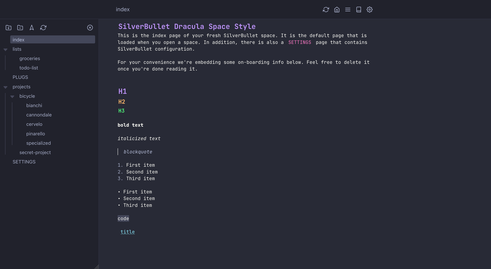

# SilverBullet Dracula Space Style 🎨

A [Dracula](https://draculatheme.com/) inspired theme for [SilverBullet](https://silverbullet.md/), a note-taking application.

> [!NOTE]
> This theme and documentation are incomplete. Please use it as you see fit and read the comments in the CSS file.

## Installation

1. Create a new page for your CSS, for example `Library/custom/styles`;
2. Copy and paste the [CSS](dracula.css) inside a new [space-style](https://silverbullet.md/Space%20Style) block:
```md
```space-style
html {
    ...
}
```
3. Reload your SilverBullet with `Ctrl + Alt + r`.
4. Done! Switching to dark mode is not required.

> [!TIP]
> This theme uses Google Fonts `@import`, and requires an active internet connection. To use local fonts, uncomment the `@font-face` lines in the CSS file. Download the required [fonts](#resources). Make sure the path of the font files is correct. Next, do not forget to remove the `@import` line from the CSS.

## Notable features

- Enabled font ligatures
- Horizontal resizable [TreeView](#resources) panel (lower right corner)
- VS Code style menu tree
- Preserve print preview

## Resources

- [Dracula colors](https://draculatheme.com/contribute#color-palette)
- [SilverBullet TreeView plug](https://github.com/joekrill/silverbullet-treeview)
- [Inter Font](https://rsms.me/inter/)
- [JetBrains Mono Font](https://www.jetbrains.com/lp/mono/)
- [JetBrains Mono Nerd Font](https://www.nerdfonts.com/font-downloads)
- [Feather icons](https://feathericons.com/)

### Menu bar icons config

Add the following lines to your SilverBullet configuration file:

```yaml
actionButtons:
- icon: home
  command: "{[Navigate: Home]}"
  description: "Go to the index page"
- icon: menu
  command: "{[Tree View: Toggle]}"
  description: "Toggle Tree View"
- icon: book
  command: "{[Navigate: Page Picker]}"
  description: "Open page"
- icon: settings
  command: "{[Open Command Palette]}"
  description: "Run command"
```

## Disclaimer

This theme is provided "as is" with no guarantee. Use it at your own risk and always test it yourself before using it in a production environment. If you find any issues, please [create a new issue](https://github.com/mroovers/silverbullet-dracula/issues/new).

## License

This theme is open-sourced software licensed under the [MIT](https://opensource.org/licenses/MIT) license.
Copyright © 2025 Marijn Roovers
